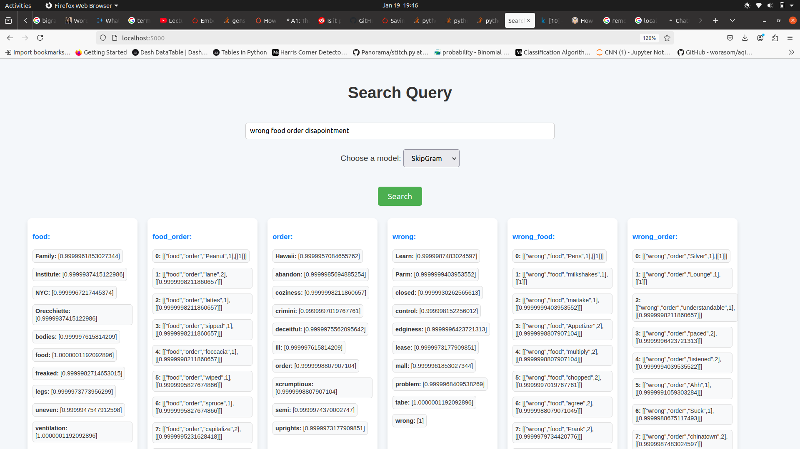

*This is NLP task1 word embeeding using skipGram, glove, and genim*

*The data is taken from huggyFace*

https://huggingface.co/datasets/fancyzhx/yelp_polarity/viewer/plain_text/train?q=food+explained

*In order to access the website please run python file, 
* The search query is simple sentence tries to find the context there two model implemented Glove and skipGram (neg Word2vec)
* The major function of the search query is limited to perform only search based on the key words and provied the relation and the context 
* for example 'good veg food' the relationship tries to find ["good","veg","sauerkraut"] 
* The current limitation to the work is since we kept window size small as per the  computational limitation some the words make more preference since they occure more frequently
* second is it does not perfom document search
* to access ths simple API deployment please follow the link (https://nlpassignments-4msu6xeaxnbs4vkxqyjsqp.streamlit.app/)
* the interpretaion the first returns are simple related tokens and the second is the relation between the tokens like "good_veg", "veg_food", "veg_good" and relative context 

